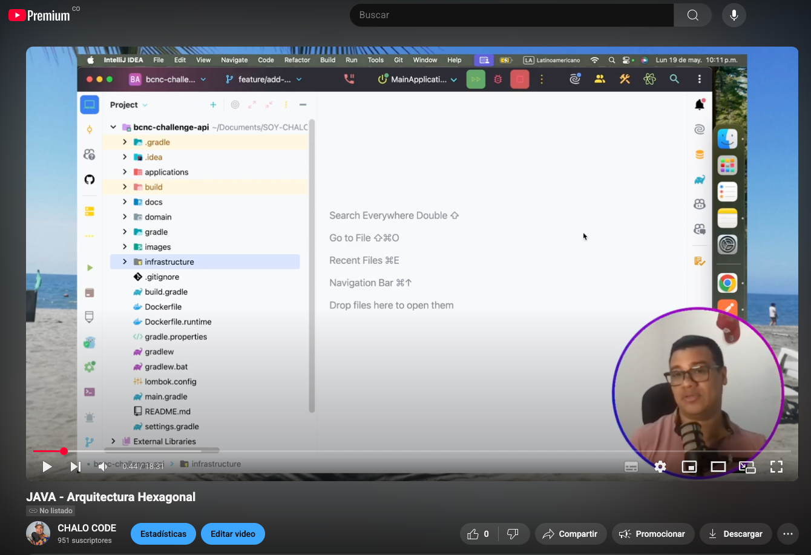
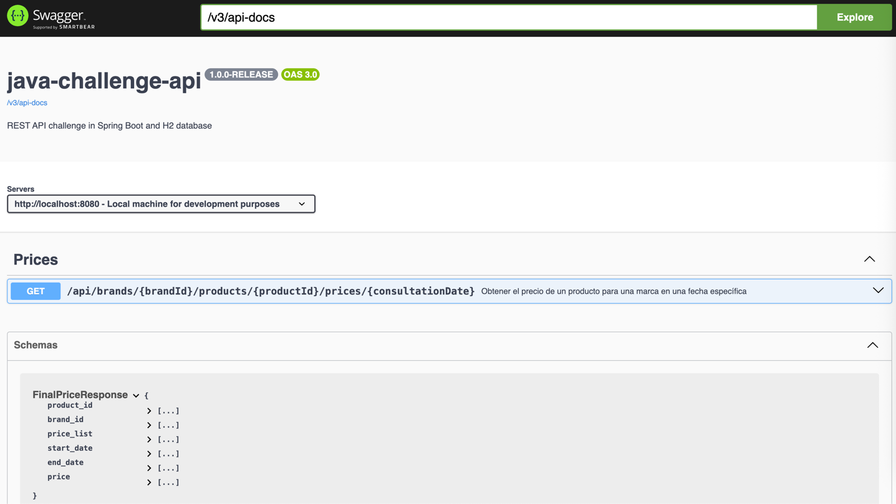
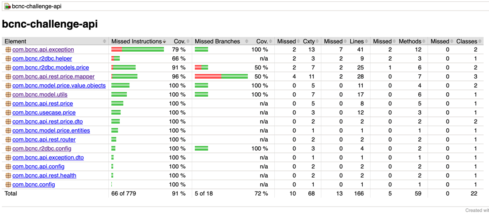

# Solución

](https://youtu.be/Pn9kx5L-0xYl)

## Prueba Técnica Inditex Core Platform

## Descripción del Proyecto

Este proyecto implementa un servicio REST para consultar precios de productos en función de una marca, un producto y una fecha específica. Utiliza una arquitectura hexagonal basada en las convenciones de **Domain-Driven Design (DDD)** para garantizar un diseño modular, escalable y fácil de mantener.

---

## Arquitectura del Proyecto

### Arquitectura Hexagonal

La arquitectura hexagonal, también conocida como **Ports and Adapters**, organiza el sistema en capas independientes que interactúan a través de interfaces. Esto permite desacoplar la lógica de negocio de las tecnologías externas.

#### Componentes Principales:
1. **Capa de Dominio**:
   - Contiene las reglas de negocio y las entidades principales.
   - Es independiente de cualquier tecnología externa.
   - **Entidades**: `Price`.
   - **Objetos de Valor**: `PriceParam`, `FinalPrice`.

2. **Capa de Dominio: caso de uso**:
   - Implementa los casos de uso del sistema.
   - **Repositorios**: `PriceRepository`.
   - Ejemplo: `PriceUseCase`.

3. **Capa de Aplicación**:
   - Inyecta los casos de uso del sistema para ser utilizados por las capas externas.
   - No contiene lógica de negocio.
   - Inicializa el proyecto
   - Ejemplo: `UseCasesConfig`.

4. **Capa de Infraestructura**:
   - Contiene los adaptadores para interactuar con tecnologías externas como bases de datos, APIs, etc.
   - Ejemplo:
      - **Adaptadores Secundarios**: `PriceService` (implementación de `PriceRepository`).
      - **Mapeadores**: `PriceMapper`.

#### Diagrama de Arquitectura
```plaintext
+-------------------+       +-------------------+
|   Infraestructura |       |   Infraestructura |
| (Adaptadores Sec.)|       | (Adaptadores Pri.)|
+-------------------+       +-------------------+
         ^                           |
         |                           v
+-------------------------------------------+
|               Capa de Aplicación             |
|  (Inicializa de Aplicación                   |
| y inyecta los caso de uso)                |
+-------------------------------------------+
         ^
         |
+-------------------+
|   Capa de Dominio |
| (Casos de Uso,    |
|  Entidades, VO,   |
|  Repositorios)    |
+-------------------+
```

---
## Guía de Ejecución

### Prerrequisitos
- **Java 17** o superior.
- **Gradle** instalado.
- **Docker** (opcional, si se usa una base de datos en contenedor).

### Pasos para Ejecutar el Proyecto
1. Clona el repositorio:
   ```bash
   git clone [URL_DEL_REPOSITORIO]
   cd [NOMBRE_DEL_PROYECTO]
   ```
2. Compila el proyecto:
   ```bash
   ./gradlew build
   ```
3. Ejecuta la aplicación:
   ```bash
   ./gradlew bootRun
   ```

### Ejecución de Tests Automatizados
Para ejecutar los tests, usa el siguiente comando:
```bash
./gradlew test
```

### CURL
Importa el siguiente curl para realizar una solicitud HTTP al endpoint:
```bash
curl --location 'localhost:8080/api/brands/1/products/35455/prices/2020-06-16 21:00:00'
```

### Acceso a la Documentación Swagger
1. Inicia la aplicación.
2. Accede a la documentación Swagger en:
   ```
   http://localhost:8080/webjars/swagger-ui/index.html
   ```
 [](http://localhost:8080/webjars/swagger-ui/index.html)
---

## Cobertura de Código

### Generar y Visualizar el Reporte de Cobertura
1. Genera el reporte de cobertura con JaCoCo:
   ```bash
   ./gradlew jacocoTestReport
   ```
2. Abre el archivo `build/reports/jacoco/test/html/index.html` en tu navegador.

[]()
---

## Caso de Uso Principal

### Descripción del Flujo
El caso de uso principal permite consultar el precio más relevante para un producto y marca en una fecha específica.

#### Flujo desde el Endpoint hasta el Repositorio:
1. **Controlador (`PriceController`)**:
    - Recibe la solicitud HTTP.
    - Valida los parámetros de entrada.
    - Convierte los datos de entrada en un modelo de dominio (`PriceParam`).
    - Llama al caso de uso correspondiente.

2. **Caso de Uso (`PriceUseCase`)**:
    - Orquesta la lógica de negocio.
    - Llama al repositorio para obtener los precios relevantes.
    - Aplica la lógica de prioridad para seleccionar el precio más relevante.
    - Devuelve el resultado como un modelo de dominio (`FinalPrice`).

3. **Repositorio (`PriceService`)**:
    - Implementa la lógica de acceso a datos.
    - Consulta la base de datos utilizando `PriceDataRepository`.
    - Convierte los datos de la base en modelos de dominio (`Price`).

4. **Base de Datos**:
    - Almacena los precios en la tabla `PRICES`.

#### Diagrama de Secuencia
```plaintext
Usuario -> Controlador -> Caso de Uso -> Repositorio -> Base de Datos
```

---

## Diagramas

### Diagrama de Arquitectura
```plaintext
+-------------------+       +-------------------+
|   Infraestructura |       |   Infraestructura |
| (Adaptadores Sec.)|       | (Adaptadores Pri.)|
+-------------------+       +-------------------+
         ^                           |
         |                           v
+-------------------------------------------+
|               Capa de Aplicación           |
|               (Inyección de casos de  Uso, |
|                 Servicios de Aplicación)   |
+-------------------------------------------+
         ^
         |
+-------------------+
|   Capa de Dominio |
| (Entidades, VO,   |
|  Casos de usos)   |
|  Repositorios)    |
+-------------------+
```

### Diagrama de Flujo del Caso de Uso
```plaintext
+-------------------+
|   PriceController |
+-------------------+
          |
          v
+-------------------+
|    PriceUseCase   |
+-------------------+
          |
          v
+-------------------+
|    PriceService   |
+-------------------+
          |
          v
+-------------------+
|    Base de Datos  |
+-------------------+
```

---

## Estructura del Proyecto

```plaintext
src/
├── main/
│   ├── java/
│   │   ├── com.bcnc.domain/       # Capa de Dominio
│   │   ├── com.bcnc.application/  # Capa de Aplicación
│   │   ├── com.bcnc.infrastructure/ # Capa de Infraestructura
│   └── resources/
│       ├── application.yml           # Configuración
├── test/                             # Tests unitarios y de integración
build.gradle                          # Configuración de Gradle
```

---
